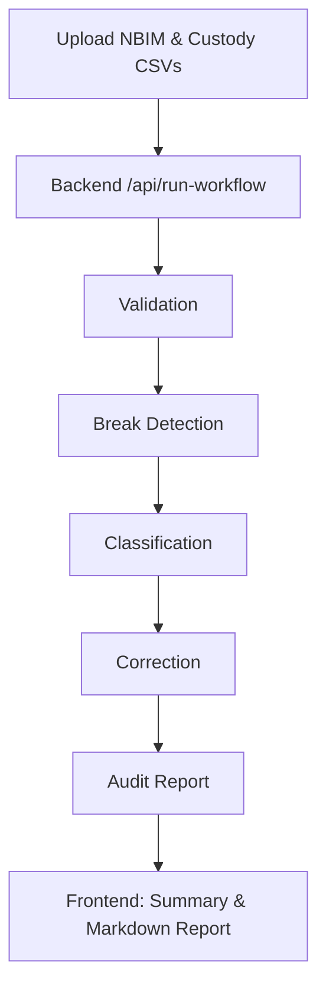

## Agentic Reconciliation

> An intelligent, AI‑powered workflow that reconciles dividend data between NBIM internal bookings and global custodian records. Built as a lightweight full‑stack prototype for the NBIM case.

[](https://www.python.org/downloads/)
[](https://fastapi.tiangolo.com/)
[](https://vuejs.org/)

## Project Overview

This system transforms manual dividend reconciliation into an agent‑driven flow. It identifies breaks between NBIM and Custody datasets, triages them into auto vs. manual candidates, and produces a readable audit report.

- **Frontend**: Minimal Vue 3 interface for file upload, results visualization, and report rendering.
- **Backend**: FastAPI service exposing a single workflow endpoint.
- **Agents**: Well‑scoped prompts per stage (validation → detection → classification → correction → audit).

## Key Features

- **Agentic pipeline**: Validation, Break Detection, Classification, Correction, and Audit Reporting.
- **User‑gated automation**: Auto‑fix candidates surfaced with confidence and priority; manual review retained where needed.
- **Context carry‑over**: Stage outputs are persisted and reused to improve downstream steps.
- **Readable reporting**: Final compliance narrative is generated in Markdown and rendered in the UI.

## System Architecture



## Quick Start

### Prerequisites
- Python 3.11+
- Node.js 20+

### Start the backend
```bash
cd backend
pip install -r requirements.txt
uvicorn server:app --host 127.0.0.1 --port 8000 --reload
```

### Start the frontend
```bash
cd frontend
npm install
npm run dev
# open http://localhost:5173
```

### Use the app
1. Upload NBIM and Custody CSV files and click “Identify Breaks”.
2. Review auto vs. manual candidates; run “Breaks Fixer” if available.
3. Generate and view the Markdown audit report.

## Architecture / Components

- **Frontend (Vue 3 + Vite)**: `AgentView.vue` (file upload + actions), `workflowService.ts` (calls), `MarkdownRenderer.vue` (report).
- **Backend (FastAPI)**: `/api/run-workflow` endpoint accepts form data (text, optional context, optional CSVs) and runs the agent workflow.
- **Agents**: Prompted stages mirrored in code and `prompt_docs/`.

## API Endpoint

- **POST** `/api/run-workflow`
  - Accepts: `input_as_text` (required), optional `context` (JSON), optional `nbim_file`, optional `custody_file`.
  - Returns: `{ success, uploaded_files, result }` with the latest stage output embedded.

## Folder Structure (high level)

```
agentic-reconciliation/
├─ backend/        # FastAPI app and workflow orchestration
├─ frontend/       # Vue 3 single‑page app
└─ prompt_docs/    # Agent prompt templates (see below)
```

## Prompt Design Philosophy

### Prompt Design Structure
- **Role Definition**: Defines the agent’s role and financial domain scope.
- **Task Clarity**: Lists the exact steps for this stage, in order.
- **Context Integration**: Describes how upstream state and inputs are consumed.
- **Output Schema**: Specifies a strict, machine‑readable structure.
- **Error Prevention**: Safety checks for consistency, deduplication, and critical flags.

## Prompt Documentation

All prompt templates are in `prompt_docs/` and correspond to the pipeline stages:

- `1_classifier_agent.md`: Routes requests into breaks identification, fixes, or report generation.
- `2_validation_agent.md`: Data Alignment & Semantic Validation across NBIM and Custody with mapping plan.
- `3_break_classifier_agent.md`: Break Detection producing a structured list of discrepancies per event.
- `4_classification_agent.md`: Break Classification & Human Review with prioritization and confidence.
- `5_correction_agent.md`: Correction & Audit Execution with safe auto‑corrections and manual recommendations.
- `6_auditing_agent.md`: Audit Trail & Report Generation that aggregates results into Markdown.

---

If a license or acknowledgements are added later, include them here.


